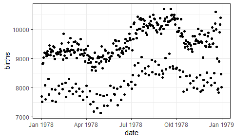

## Using RMarkdown

### Text

Text can be decorated with **bold** or *italics*.  It is also possible to 

* create [links](http://rmarkdown.rstudio.com/) 
* include mathematics like $e=mc^2$ or 
$$y = \beta_0 + \beta_1 x_1 + \beta_2 x_2$$


Be sure to put a space after the * when you are creating bullets and a space after # when 
creating section headers, but **not** between $ and the mathematical formulas.

### Graphics

If the code of an R chunk produces a plot, this plot can be displayed in the resulting file.

```r
gf_point(births ~ date, data = Births78)
```

<!-- -->

### R output
Other forms of R output are also displayed as they are produced.

```r
favstats(~ births, data = Births78)
```

```
##   min   Q1 median   Q3   max     mean       sd   n missing
##  7135 8554   9218 9705 10711 9132.162 817.8821 365       0
```

### Destination formats

This file can be knit to HTML, PDF, or Word.  In RStudio, just select the desired output file type
and click on `Knit HTML`, `Knit PDF`, or `Knit Word`.  Use the dropdown menu next to that to 
change the desired file type.

### Documenting file creation 

It's useful to record some information about how your file was created.

  * File creation date: 2024-06-07
  * R version 4.1.2 (2021-11-01)
  * R version (short form): 4.1.2
  * `mosaic` package version: 1.8.3
  * Additional session information
  

```
## R version 4.1.2 (2021-11-01)
## Platform: x86_64-w64-mingw32/x64 (64-bit)
## Running under: Windows 10 x64 (build 22631)
## 
## Matrix products: default
## 
## locale:
## [1] LC_COLLATE=German_Germany.1252  LC_CTYPE=German_Germany.1252   
## [3] LC_MONETARY=German_Germany.1252 LC_NUMERIC=C                   
## [5] LC_TIME=German_Germany.1252    
## 
## attached base packages:
## [1] stats     graphics  grDevices utils     datasets  methods   base     
## 
## other attached packages:
## [1] mosaic_1.8.3      ggridges_0.5.3    mosaicData_0.20.2 ggformula_0.10.1 
## [5] ggstance_0.3.5    dplyr_1.1.2       Matrix_1.3-4      ggplot2_3.4.2    
## [9] lattice_0.20-45  
## 
## loaded via a namespace (and not attached):
##  [1] ggrepel_0.9.1     Rcpp_1.0.7        tidyr_1.3.0       digest_0.6.29    
##  [5] utf8_1.2.2        ggforce_0.3.3     R6_2.5.1          plyr_1.8.6       
##  [9] backports_1.4.1   labelled_2.9.0    evaluate_0.14     highr_0.9        
## [13] pillar_1.9.0      rlang_1.1.0       rstudioapi_0.15.0 jquerylib_0.1.4  
## [17] rmarkdown_2.11    labeling_0.4.2    splines_4.1.2     readr_2.1.4      
## [21] stringr_1.5.1     htmlwidgets_1.5.4 polyclip_1.10-0   munsell_0.5.0    
## [25] broom_1.0.5       compiler_4.1.2    xfun_0.29         pkgconfig_2.0.3  
## [29] htmltools_0.5.2   tidyselect_1.2.0  tibble_3.2.1      gridExtra_2.3    
## [33] mosaicCore_0.9.0  fansi_0.5.0       withr_2.5.0       tzdb_0.2.0       
## [37] MASS_7.3-54       grid_4.1.2        jsonlite_1.8.4    gtable_0.3.0     
## [41] lifecycle_1.0.3   magrittr_2.0.3    scales_1.2.1      cli_3.6.1        
## [45] stringi_1.7.6     farver_2.1.0      leaflet_2.1.1     bslib_0.3.1      
## [49] ggdendro_0.1.23   generics_0.1.1    vctrs_0.6.1       tools_4.1.2      
## [53] forcats_1.0.0     glue_1.6.2        tweenr_1.0.2      purrr_1.0.1      
## [57] hms_1.1.3         crosstalk_1.2.0   fastmap_1.1.0     yaml_2.2.1       
## [61] colorspace_2.0-2  knitr_1.37        haven_2.5.2       sass_0.4.0
```
  
